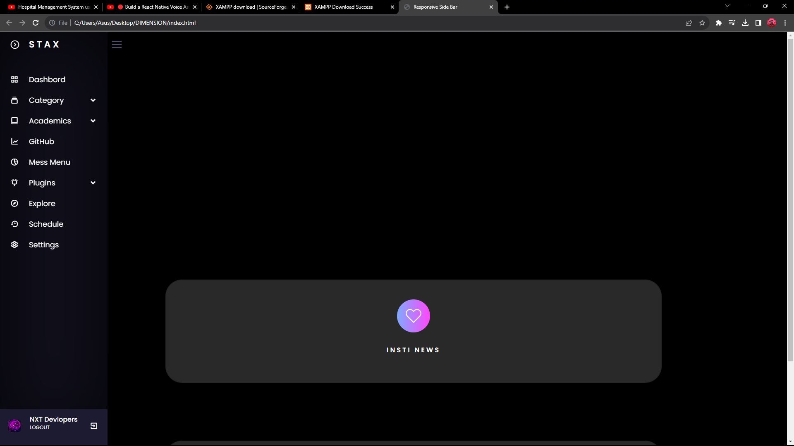
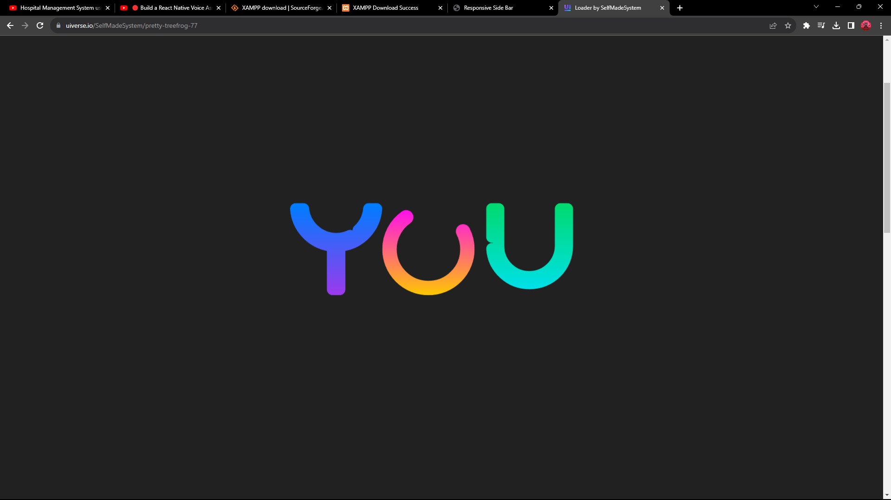

# Dimension
<h1>🎓 IIT Bombay Dashboard</h1>

Welcome to the IIT Bombay Dashboard repository! Our comprehensive dashboard serves as a centralized platform for students, faculty, and administrators at IIT Bombay, providing essential tools and resources for efficient management and communication within the institute.
 
📚 Features:
 
- Personalized student dashboard offering access to academic resources, course schedules, grades, and extracurricular activities.
-  
- Faculty portal facilitating seamless communication with students, course management, and academic resource sharing.
-  
- Robust administrative interface for efficient management of campus operations, including resource allocation, event coordination, and communication with students and faculty.
-  
- Integration of essential features ensuring smooth coordination among students, faculty, and administrators, fostering a cohesive and well-connected academic community.
-  
 
🚀 Technologies:
 
Our dashboard leverages cutting-edge technologies, ensuring a seamless user experience, robust functionality, and data security.
 
 

👥 This project represents the collaborative effort of a dedicated team of developers, committed to enhancing the academic experience and administrative efficiency at IIT Bombay.
 

Feel free to explore our codebase and contribute to the advancement of the IIT Bombay Dashboard. If you have any suggestions or feedback, please don't hesitate to reach out.
 

 
 
 
 
Thank you for visiting the IIT Bombay Dashboard repository.
<h1> Dashboard </h1>

<h1> Pre Loader </h1>

